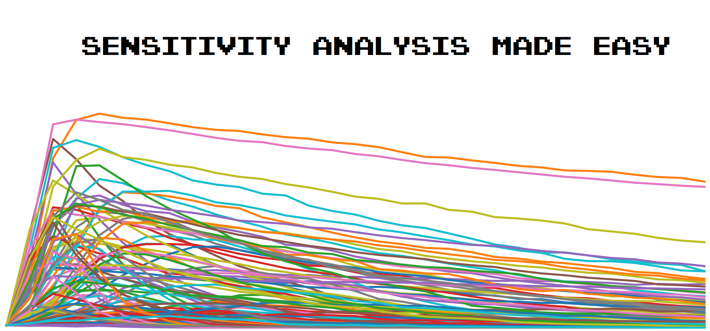

# Sensitivity Analysis Made Easy with the EMA Workbench

*"Since all models are wrong the scientist must be alert to what is importantly wrong. It is inappropriate to be concerned about mice when there are tigers abroad."* George Box, 1976.

<p align="center">
  
</p>

## TL;DR
You must do SA. Just must. Why? Because it helps to:

* identify a subset of important model parameters,
* debug the model,
* better plan policy interventions.

If you aren't convinced yet, [here](https://www.nature.com/articles/s43588-021-00028-9) is a nice example of SA usage. So get some ☕, jump into [`3-sa_demo_virus_on_network.ipynb`](3-sa_demo_virus_on_network.ipynb) and check how easy it is now!

## SA explained visually
What to expect from SA? Let's explain it with a figure that we borrowed from the EMA Workbench [documentation](https://emaworkbench.readthedocs.io/en/latest/). 

Imagine an abstract model that have 5 parameters: `b`, `delta`, `mean`, `q` and `stdev`. And a single outcome of interest `y`. We run a fancy algorithm on it and get this: a barplot 🤯. This bar plot shows how impactful each of the parameters to our outcome of interest. The more the bar, the more the impact. For example, `b` is very impactful, while `delta` has no impact whatsoever. Each of the bars also has error bars in them representing confidence intervals. You can also notice that there are two types of bars: S1 and ST. These are *Sobol* indices. In short, S1 shows how much does a variable add to the variance of `y` on its own and ST shows how much does a variable add to the variance of `y`, including all its interactions? Tricky to understand at first, but don't worry, [here](https://salib.readthedocs.io/en/latest/basics.html) is an extra reading material. To summarize, now we know which variables are "important" the most and to what extent: `beta` (the most impactful), `mean` and `q` (less impactful). 

<p align="center">
  
</p>

## What is this repo?
It's a collection of Jupyter Notebooks where we demonstrate how to use [*Variance-based sensitivity analysis*](https://en.wikipedia.org/wiki/Variance-based_sensitivity_analysis) aka Sobol on two famous agent-based models: [`Virus on a Network`](https://github.com/projectmesa/mesa/tree/master/examples/virus_on_network) and [`Wolf-Sheep`](https://github.com/projectmesa/mesa-examples/tree/master/examples/WolfSheep). These models are made with [`Mesa`](https://mesa.readthedocs.io/en/stable/) simulation package written in Python. But guess what? It can be a [`NetLogo`](https://pynetlogo.readthedocs.io/en/latest/) model as well. And a [`Vensim`](https://vensim.com/vensim-software/) model. And even an Excel model 🤯! To do the analysis we use [`EMA Workbench`](https://emaworkbench.readthedocs.io/) to perform experiments, [`SALib`](https://salib.readthedocs.io/) to do sensitivity analysis on [`Google Colab`](https://colab.research.google.com/).

We tried to make the notebooks easy to understand and follow - it's just an introduction. Also, we hope that you can use them as templates to analyze your models ❤️. Use [`3-sa_demo_virus_on_network.ipynb`](3-sa_demo_virus_on_network.ipynb) as the most comprehensive template.

## How to use this repo?
You'll need a). Google Account and ... that's it. For the workshop, we will use [`Google Colab`](https://colab.research.google.com/) which allows us to run the code stored on GitHub in the cloud. Alternatively, you can use your local Python installation and [`environment.yml`](environment.yml) to recreate a virtual environment.

We ordered notebooks for the workshop, but you're free to take a look at any. Word *live* means that it will be used as a live-coding exercise during the workshop, notebooks with *practice* are made as small practical challenges and the word *demo* means that notebook is complete and can be used as a reference. 

Here is the repo structure:

```
|   0-ema_demo.ipynb                      - short demo on how to use EMA Workbench
|   1-sa_live_virus_on_network.ipynb      - live-coding with Raphael Klein
|   2-sa_practice_virus_on_network.ipynb  - exercise for the participants
|   3-sa_demo_virus_on_network.ipynb      - complete SA on the Virus on a Network 
|   4-sa_practice_wolf_sheep.ipynb        - second exercise for the participants
|   5-sa_demo_wolf_sheep.ipynb            - complete SA on the Wolf-Sheep
|       
+---results                               - saved experiments results
|           
+---src                                   - supplementary functions
|           
+---virus_on_network                      - Virus on a Network Mesa model code
|           
+---wolf_sheep                            - Wolf-Sheep Mesa model code      
```

## Authors & acknowledgements
 *Raphael Klein* [@RaphaelKl1](https://twitter.com/RaphaelKl1),
 *Patrick Steinmann* [@steipat](https://twitter.com/steipatr),
 *Mikhail Sirenko* [@mikhailsirenko](https://twitter.com/mikhailsirenko)

 And of course, we would like to thank *Jan Kwakkel*[@jan_kwakkel](https://twitter.com/jan_kwakkel) and *Marc Jaxa-Rozen* for their practical and theoretical contribution into ideas and the code behind this workshop, core developers and contributors of [EMA Workbench](https://emaworkbench.readthedocs.io/en/latest/), [Mesa: Agent-based modeling in Python 3+](https://mesa.readthedocs.io/en/stable/) and [SALib](https://salib.readthedocs.io/en/latest/).